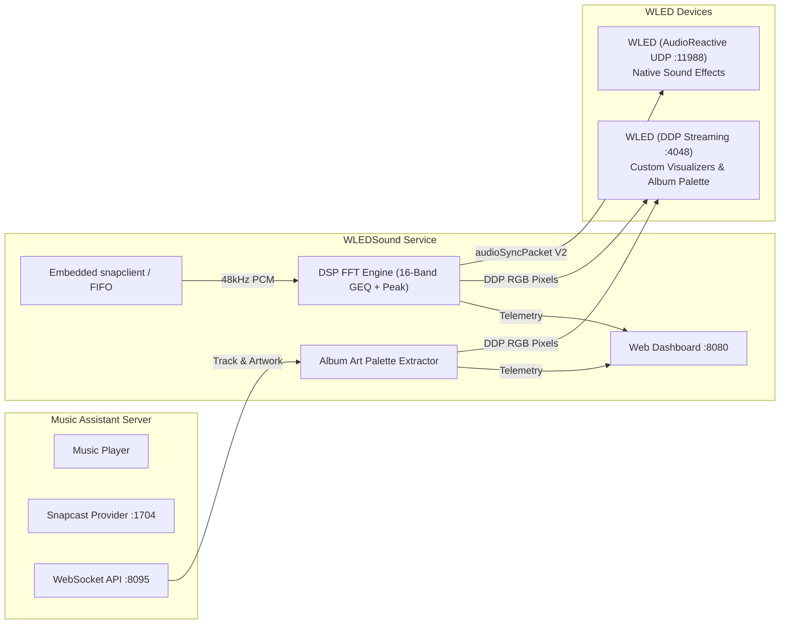

# WLEDSound 🎵💡
> **Real-time audio-reactive lighting bridge connecting Music Assistant, Snapcast, and WLED.**

[](https://www.python.org/downloads/)
[](https://opensource.org/licenses/MIT)
[](https://kno.wled.ge)
[](https://music-assistant.io)

**WLEDSound** is a high-performance, low-latency microservice that makes your WLED LED lights dance in sync with music playing from your **Music Assistant** instance.

---

## ✨ Features

- ⚡ **Dual Output Modes (Hybrid Architecture)**:
  - **WLED AudioReactive UDP Sync (Port 11988)**: Emulates an AudioReactive microphone source (`audioSyncPacket V2`), broadcasting 16-band GEQ spectrum data, peak/onset triggers, and AGC metrics directly to WLED devices so native sound-reactive effects dance to your music without needing any physical microphone on the ESP32!
  - **Direct DDP Pixel Streaming (Port 4048)**: Streams 24-bit RGB frames at 60fps directly to any standard WLED strip (no AudioReactive build needed).
- 🎨 **Dynamic Album Art Palette Sync**:
  - Automatically fetches the active album artwork from Music Assistant.
  - Extracts the top 5 dominant, vibrant colors using color quantization and HSL scoring.
  - Dynamically paints DDP visualizers and pushes palette colors to WLED segment colors via the WLED HTTP JSON API.
- ⏱️ **Microsecond Audio Sync via Snapcast**:
  - Taps into Music Assistant's native Snapcast server using an embedded `snapclient` instance (or named pipe FIFO).
  - Sample-accurate, drift-free synchronization matching the speakers in your home.
- 🎛️ **Modern Glassmorphic Web Dashboard**:
  - Live 60 FPS HTML5 Canvas spectrum visualizer with peak hold dots and oscilloscope overlay.
  - Live "Now Playing" card with glowing ambient backdrops, track metadata, and clickable palette swatches.
  - Real-time sliders for Sensitivity (Gain), Smoothing, and Noise Gate (Squelch).
  - One-click hardware quick actions: Test Beat Flash, Toggle Power, and Palette Push.
- 🧪 **Built-in Synthetic Beat Generator**:
  - Zero-setup test mode (128 BPM electronic kick/bass/pad loop) to verify lights and network connectivity before streaming live audio.
- 🐳 **Docker & Home Assistant Ready**:
  - Pre-built Docker container with `snapclient` pre-installed.

---

## 🏛️ System Architecture



---

## 🚀 Quick Start (Docker Compose)

### 1. Clone the repository
```bash
git clone https://github.com/your-username/wledsound.git
cd wledsound
```

### 2. Configure Settings
Copy `config.example.yaml` to `config/config.yaml`:
```bash
mkdir -p config
cp config.example.yaml config/config.yaml
```

Edit `config/config.yaml` to point to your devices:
```yaml
audio:
  mode: "snapclient"
  snapserver_host: "192.168.1.100" # IP of your Music Assistant / Snapcast server
  snapserver_port: 1704

wled:
  mode: "hybrid" # or "audiosync" or "ddp"
  audiosync_targets:
    - "239.0.0.1" # Default WLED multicast or your WLED IP
  ddp_targets:
    - "192.168.1.150" # IP of your WLED strip
  wled_hosts:
    - "192.168.1.150" # For power on/off & album palette sync

music_assistant:
  enabled: true
  server_url: "http://192.168.1.100:8095" # Music Assistant server URL
```

### 3. Launch with Docker Compose
```bash
docker-compose up -d
```

Open your browser and navigate to:
**`http://<docker_host_ip>:8080`**

---

## 💻 Local Standalone Installation (Linux / macOS)

### Prerequisites
- Python 3.10+
- `snapclient` (optional if using `test` mode):
  - Ubuntu/Debian: `sudo apt install snapclient`
  - macOS: `brew install snapcast`

### Setup
```bash
# 1. Create and activate virtual environment
python3 -m venv .venv
source .venv/bin/activate

# 2. Install dependencies
pip install -r requirements.txt

# 3. Launch service
python3 -m wledsound.main config.yaml
```

---

## ⚙️ WLED Configuration Guide

### For Native WLED Sound Reactive Effects (AudioSync Mode)
1. In WLED, open **Config** ➔ **Sync Interfaces**.
2. Scroll to the **Audio Sync** section.
3. Set **Audio Sync Mode** to **Receive** (or ensure Receive UDP is enabled).
4. Default UDP Port is `11988`. Ensure it matches `audiosync_port` in `config.yaml`.
5. Under **WiFi Setup**, ensure **Disable WiFi Sleep** is checked for low-latency UDP reception.
6. Select any of WLED's 35+ sound-reactive effects (e.g. *GEQ*, *Freqwave*, *Gravimeter*, *DJ Light*, *Blotch*).

### For Direct DDP Pixel Streaming (DDP Mode)
- Works out of the box with any WLED version (0.13+).
- WLED automatically accepts DDP packets on UDP port `4048` and displays the frames immediately with zero configuration needed.

---

## 🎶 Music Assistant Setup

1. In **Music Assistant** ➔ **Settings** ➔ **Player Providers**:
   - Ensure the **Snapcast** provider is installed and enabled.
2. Group or assign the `snapclient` player into your playback group so that music streams to it in unison with your room speakers.
3. WLEDSound connects to Music Assistant's WebSocket API on port `8095` to listen for track metadata and fetch artwork.

---

## 📊 Configuration Reference (`config.yaml`)

| Section | Parameter | Default | Description |
|---|---|---|---|
| `audio` | `mode` | `snapclient` | Audio capture: `snapclient`, `fifo`, or `test` |
| `audio` | `snapserver_host` | `127.0.0.1` | Hostname or IP of the Snapserver |
| `audio` | `snapserver_port` | `1704` | Snapserver stream TCP port |
| `audio` | `gain` | `1.0` | Master audio input sensitivity (0.2 - 4.0) |
| `audio` | `smoothing` | `0.25` | Exponential level smoothing factor (0.05 - 0.75) |
| `audio` | `squelch` | `0.005` | Silence threshold to suppress idle noise |
| `wled` | `mode` | `hybrid` | Output mode: `hybrid`, `audiosync`, or `ddp` |
| `wled` | `audiosync_targets` | `["239.0.0.1"]` | Target IPs for AudioReactive UDP (multicast/unicast) |
| `wled` | `audiosync_port` | `11988` | AudioSync UDP port |
| `wled` | `protocol_version` | `2` | `2` for WLED 0.14+ (MoonModules / upstream), `1` for legacy |
| `wled` | `ddp_targets` | `[]` | List of WLED IP addresses for DDP pixel streaming |
| `wled` | `led_count` | `60` | Number of addressable LEDs on strip |
| `wled` | `ddp_effect` | `album_pulse` | DDP effect: `album_pulse`, `geq_spectrum`, `energy_wave`, `vu_meter`, `beat_flash` |
| `wled` | `auto_power` | `true` | Turn WLED on during playback, off/idle when paused |
| `wled` | `sync_album_art_colors` | `true` | Push 5 extracted album colors to WLED segment colors |
| `music_assistant` | `enabled` | `true` | Enable Music Assistant metadata tracking |
| `music_assistant` | `server_url` | `http://127.0.0.1:8095` | Music Assistant HTTP/WebSocket URL |
| `web` | `port` | `8080` | Web Dashboard listening port |

---

## 🛠️ Testing & Troubleshooting

### Run Unit Tests
```bash
source .venv/bin/activate
python -m pytest -v
```

### Common Issues
- **Multicast packets not reaching WLED**:
  - Some home routers block UDP multicast (`239.0.0.1`) across WiFi.
  - *Fix*: In `config.yaml`, add your WLED device's direct unicast IP to `audiosync_targets` (e.g. `audiosync_targets: ["192.168.1.150"]`).
- **Music Assistant Artwork not updating**:
  - Verify port `8095` is accessible from the container or host.
  - Check the Music Assistant connection badge in the top right of the WLEDSound dashboard.

---

## 📄 License
MIT License. Feel free to use, modify, and contribute!
